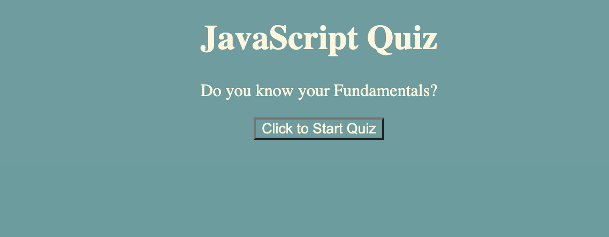

# Timed_Quiz: JavaScript Fundamentals (incomplete)

## Background
- As a coding boot camp student, I am making a timed quiz on JavaScript fundamentals. The goal is utilize the tools I have been provided with during class as well as outside resources. The quiz will also store high scores to allow myself to gauge my progress. 

## Quiz Targets:
- When the start button is clicked, a timer starts and the user is presented with a question and answers. 
- When the question is answered (right or wrong), another question is presented
- If the answer is incorrect, a penalty is applied by reducing the time.
- When all questions are answered or the time is up, the game is over
- At the end of game, the user can enter their initials and score to a leader board.

# Quiz Preview 
> Preview  

## Repository & Webpage:
- URL: https://github.com/mgmedrano/Timed_Quiz
- GitHub Repository: https://mgmedrano.github.io/Timed_Quiz/